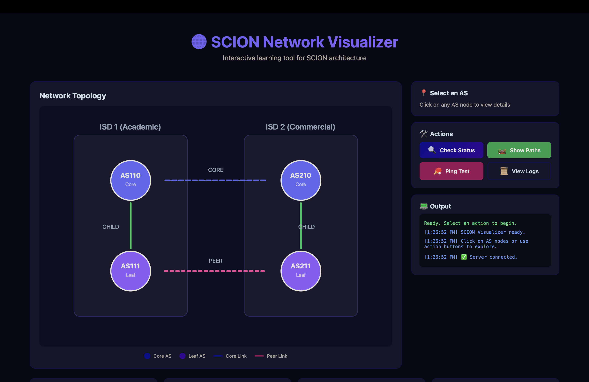
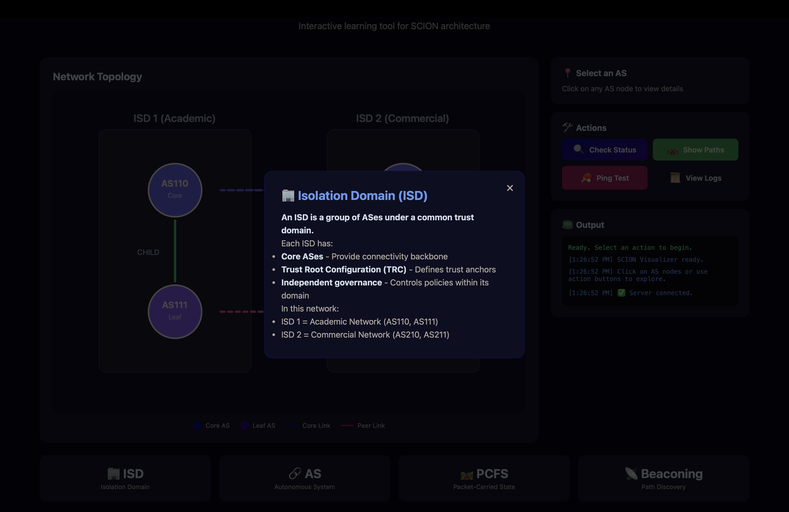
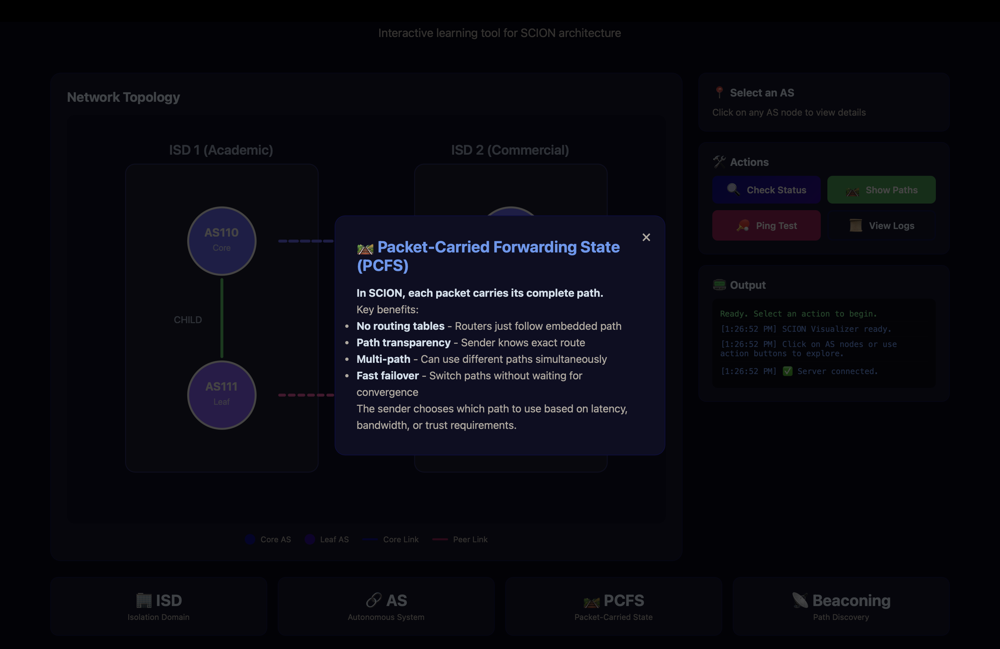
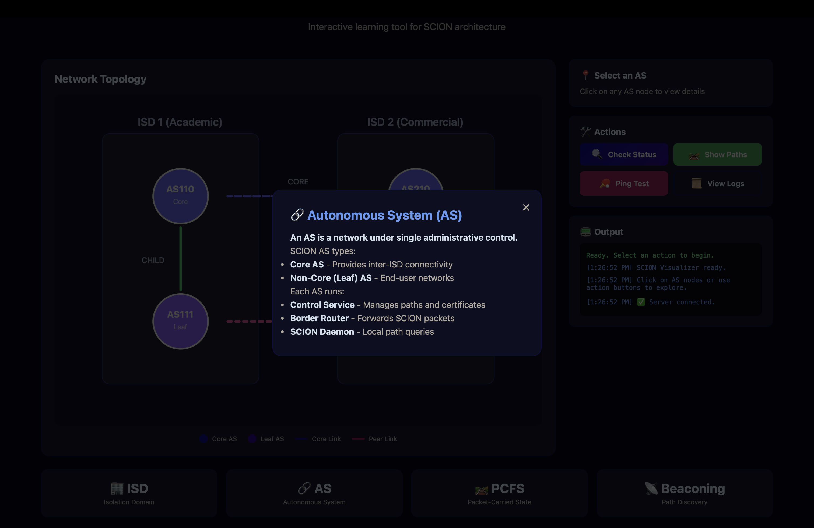
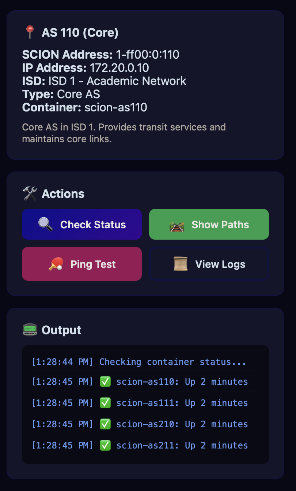
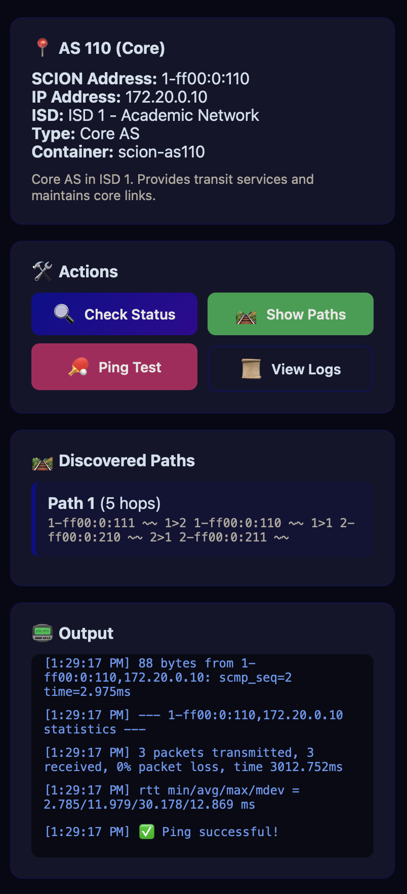
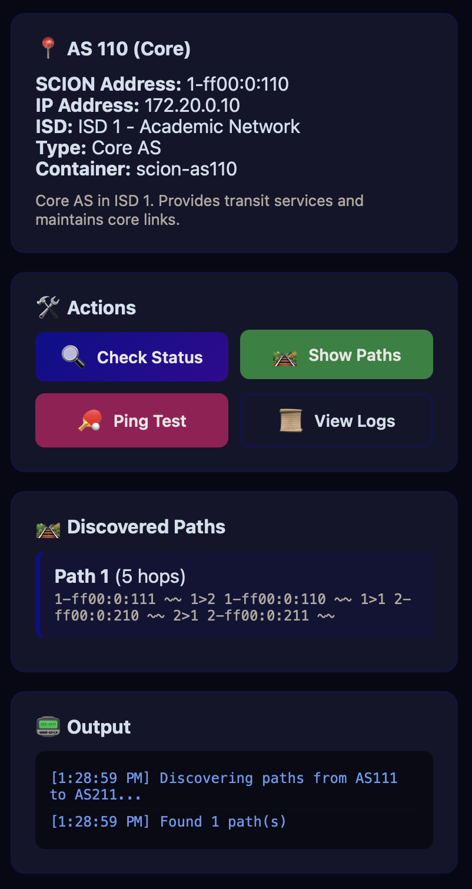
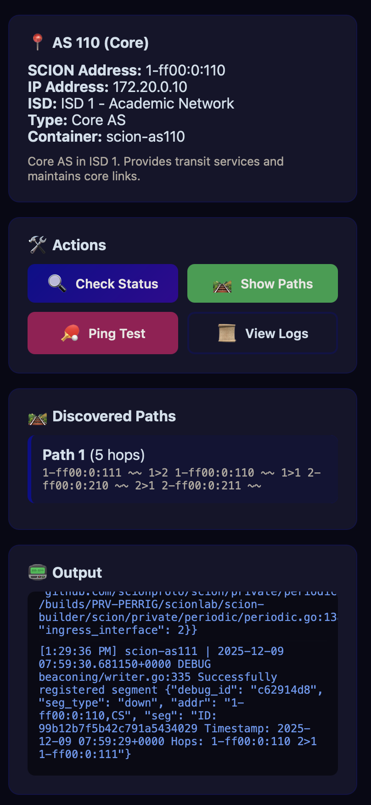

# SCION MiniNet 🌐

> **An educational project for learning SCION architecture through hands-on experimentation**

Inspired by the groundbreaking research at [ETH Zurich](https://netsec.ethz.ch/research/scion/) and the [SCION Association](https://www.scion.org/association/), this project provides a local, containerized SCION network for students, researchers, and developers to explore path-aware networking without needing access to the global [SCIONLab](https://www.scionlab.org/) testbed.

## 🎯 Project Goals

- **Learn by Doing** — Run a complete SCION network locally and see how it differs from traditional BGP-based routing
- **Understand Path-Awareness** — Experience sender-selected paths, multi-path communication, and instant failover
- **Explore SCION Concepts** — Isolation Domains (ISDs), beaconing, Trust Root Configurations (TRCs), and cryptographic path validation
- **Safe Experimentation** — Break links, simulate failures, and observe network behavior without affecting production systems

## 🔬 Background

SCION (Scalability, Control, and Isolation on Next-generation Networks) was developed at ETH Zurich as a clean-slate Internet architecture that addresses fundamental security and reliability issues in today's Internet. Unlike BGP, SCION gives end hosts control over their network paths and provides cryptographic guarantees about path authenticity.

This project is **not affiliated** with ETH Zurich or the SCION Association — it's an independent learning resource built on top of the open-source [scionproto/scion](https://github.com/scionproto/scion) implementation.


## 🏗️ Network Topology

```
                    ┌─────────────────────────────────────────────────────────┐
                    │                     SCION Network                        │
                    └─────────────────────────────────────────────────────────┘
                                              
     ┌──────────────────────────────┐         ┌──────────────────────────────┐
     │   ISD 1 (Academic Network)   │         │  ISD 2 (Commercial Network)  │
     │                              │         │                              │
     │  ┌────────────────────────┐  │  CORE   │  ┌────────────────────────┐  │
     │  │   AS 1-ff00:0:110      │◄─┼────────►┼──│   AS 2-ff00:0:210      │  │
     │  │   (Core AS)            │  │  Link   │  │   (Core AS)            │  │
     │  │   • Control Service    │  │         │  │   • Control Service    │  │
     │  │   • Border Router      │  │         │  │   • Border Router      │  │
     │  │   • SCION Daemon       │  │         │  │   • SCION Daemon       │  │
     │  └───────────┬────────────┘  │         │  └───────────┬────────────┘  │
     │              │ CHILD         │         │              │ CHILD         │
     │              ▼               │         │              ▼               │
     │  ┌────────────────────────┐  │         │  ┌────────────────────────┐  │
     │  │   AS 1-ff00:0:111      │  │  PEER   │  │   AS 2-ff00:0:211      │  │
     │  │   (Leaf AS)            │◄─┼────────►┼──│   (Leaf AS)            │  │
     │  │   • Control Service    │  │  Link   │  │   • Control Service    │  │
     │  │   • Border Router      │  │         │  │   • Border Router      │  │
     │  │   • SCION Daemon       │  │         │  │   • SCION Daemon       │  │
     │  │   • End Host (host-111)│  │         │  │   • End Host (host-211)│  │
     │  └────────────────────────┘  │         │  └────────────────────────┘  │
     │                              │         │                              │
     └──────────────────────────────┘         └──────────────────────────────┘

     Available Paths from host-111 to host-211:
     ━━━━━━━━━━━━━━━━━━━━━━━━━━━━━━━━━━━━━━━━━━━━━━━━━━━━━━━━━━━━━━━━━━━━━━━━━━
     Path 1 (Direct):     111 ──PEER──► 211
     Path 2 (Via Cores):  111 ──PARENT──► 110 ──CORE──► 210 ──CHILD──► 211
```

## 🚀 Quick Start

### Prerequisites
- Docker & Docker Compose
- Bash shell
- ~2GB disk space for SCION images

### Launch the Network

```bash
# 1. Clone this repository
git clone <repo-url> && cd SCIONMiniNet

# 2. Generate configuration files
make setup

# 3. Start the network
make up

# 4. Wait for convergence (~20 seconds)
sleep 20

# 5. Explore paths between ASes
make paths

# 6. Send ping across the network
make ping
```

## 📸 Screenshots

### GUI Visualizer (`make visualizer`)

| Network Topology | AS Details | Path Discovery |
|:---:|:---:|:---:|
|  |  |  |

| Container Status | Ping Test |
|:---:|:---:|
|  |  |

### Terminal Commands

| Setup & Start | Path Discovery |
|:---:|:---:|
|  |  |

| Container Status | SCION Ping |
|:---:|:---:|
|  |  |

## 📖 SCION Fundamentals

This project teaches these core SCION concepts:

### 🏢 Isolation Domains (ISDs)
ISDs are administrative regions that manage trust and routing policies. Our topology has:
- **ISD 1**: Academic Network (AS 110, AS 111)
- **ISD 2**: Commercial Network (AS 210, AS 211)

### 🔗 AS Relationships
- **CORE**: Links between core ASes (backbone)
- **CHILD/PARENT**: Hierarchical provider-customer links
- **PEER**: Direct connections between non-hierarchical ASes

### 🛤️ Path Discovery
Unlike BGP, SCION endpoints discover ALL available paths and choose which to use:
```bash
make paths   # See all paths from AS111 to AS211
```

### 📦 Packet-Carried Forwarding State (PCFS)
Each SCION packet carries its complete path in the header. Routers don't need routing tables—they just follow the embedded path.

### 🎯 Path Selection
The sender (not the network) chooses the path based on:
- Latency requirements
- Bandwidth needs
- Trust/jurisdiction constraints
- Failover policies

```bash
make interactive  # Manually select a path and ping over it
```

## 🛠️ CLI Tools

| Command | Description |
|---------|-------------|
| `make paths` | Show all available paths from AS111 to AS211 |
| `make ping` | Send SCMP echo requests |
| `make measure` | Measure latency on each path |
| `make interactive` | Interactive path selection and ping |
| `make shell-111` | Shell into host in AS 1-ff00:0:111 |
| `make shell-211` | Shell into host in AS 2-ff00:0:211 |

## 🧪 Experiments

### 1. Link Failure & Failover
```bash
# Break the core link by stopping AS110's router
make break-link ROUTER=router-110

# Observe: only the PEER path remains
make paths

# Restore the link
make restore-link ROUTER=router-110
```

### 2. Path Latency Comparison
```bash
# Measure RTT on all available paths
make measure

# Compare: which path is faster?
# The PEER link (111→211) should be faster than via cores
```

### 3. Multi-Path Transfer
```bash
# Open two terminals and send traffic on different paths
# Terminal 1:
make shell-111
scion ping 2-ff00:0:211 -c 100

# Terminal 2:
make shell-211
scion ping 1-ff00:0:111 -c 100
```

## 📁 Project Structure

```
SCIONMiniNet/
├── Makefile                 # All commands
├── README.md               # This file
├── docker-compose.yml      # Container orchestration
├── topology/
│   └── topology.topo       # SCION topology definition
├── scripts/
│   ├── setup.sh           # Generates configs
│   └── cleanup.sh         # Removes generated files
├── bin/
│   ├── scion-paths        # Path discovery
│   ├── scion-ping         # SCMP ping
│   ├── scion-measure      # Latency measurement
│   └── scion-interactive  # Interactive explorer
├── docs/
│   ├── CONCEPTS.md        # SCION deep-dive
│   └── EXPERIMENTS.md     # Guided experiments
└── gen/                   # Generated configs (gitignored)
```

## 🔧 Modifying the Topology

Edit `topology/topology.topo` to add ASes or links:

```yaml
ASes:
  "1-ff00:0:112":              # Add a new AS
    cert_issuer: 1-ff00:0:110
    mtu: 1472

links:
  # Add new link
  - {a: "1-ff00:0:111#3", b: "1-ff00:0:112#1", linkAtoB: PEER}
```

Then regenerate and restart:
```bash
make clean
make setup
make up
```

## 🤝 Extending to Multi-Path Transfers

SCION applications can use multiple paths simultaneously:

1. **Discover paths**: Query the daemon for all available paths
2. **Distribute traffic**: Split data across paths based on capacity
3. **Handle failures**: Automatically failover when a path breaks

See [docs/EXPERIMENTS.md](docs/EXPERIMENTS.md) for a multi-path implementation guide.

## 📚 Further Reading

- [SCION Book](https://scion-architecture.net/book/) - Comprehensive guide
- [scionproto/scion](https://github.com/scionproto/scion) - Reference implementation
- [SCIONLab](https://www.scionlab.org/) - Global testbed

## 🐛 Troubleshooting

**Paths not showing?**
```bash
# Wait for beacon propagation
sleep 30 && make paths
```

**Containers not starting?**
```bash
# Check Docker status
docker compose ps
docker compose logs
```

**Permission denied?**
```bash
chmod +x scripts/*.sh bin/*
```

## 📄 License

MIT License - See [LICENSE](LICENSE) for details.

---

*Built for learning SCION fundamentals through hands-on experimentation.*
